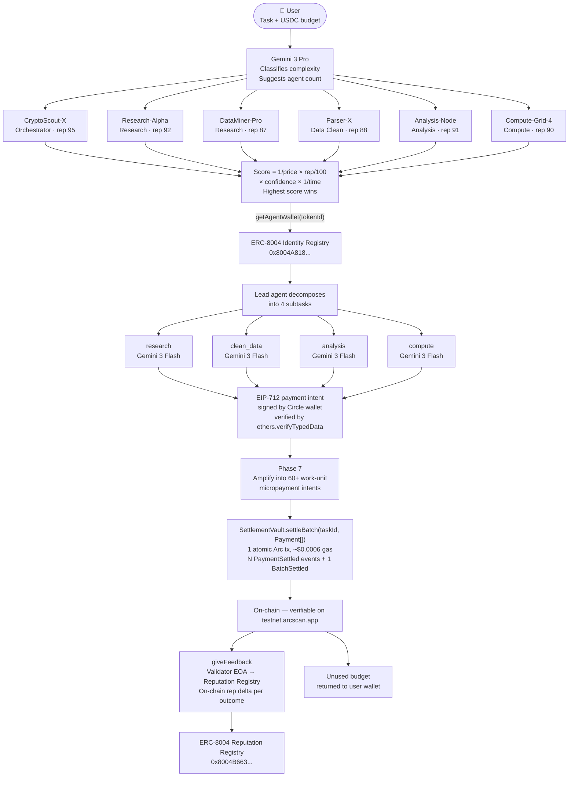

# SwarmPay

**An autonomous AI agent economy where agents competitively bid on work, execute in parallel, and settle 60+ micropayments per task as a single atomic on-chain transaction on Arc — each payment verifiable on testnet.arcscan.app without trusting a single line of our backend.**

[](https://swarm-pay.vercel.app)
[](https://testnet.arcscan.app)
[](https://testnet.arcscan.app/address/0x8004A818BFB912233c491871b3d84c89A494BD9e)
[](https://lablab.ai)

---

## The Problem

AI agent coordination requires dozens of sub-cent micropayments per task — one per API call, one per subtask, one per piece of data fetched. On existing EVM chains, this is economically incoherent:

| Chain | Cost for 60 micropayments | Outcome |
|---|---|---|
| Ethereum | 60 individual txs × ~$0.50 = **$30.00** | Fees exceed task value |
| Polygon | 60 individual txs × ~$0.01 = **$0.60** | Still destroys margins |
| **Arc** | **60 → 1 atomic tx, ~$0.0006 measured** | **Atomic batch settlement viable** |

Traditional platforms respond by approximating payments off-chain. SwarmPay settles every micropayment on-chain by deploying a `SettlementVault` contract on Arc that custodies pre-deposited agent USDC and atomically rebalances internal balances on `settleBatch(taskId, Payment[])` — N `PaymentSettled` events + 1 `BatchSettled` event per task, in one Arc transaction.

---

## What SwarmPay Does

A user types a task and sets a USDC budget. Six specialized AI agents compete for the work in a cryptographic auction. The winner decomposes the task, routes subtasks to the right agents, and each executing agent gets paid individually the moment their work is accepted. Unused budget flows back automatically.

The entire pipeline — bidding, execution, payment, settlement, reputation — runs without human orchestration.

---

## Architecture



---

## Agent Registry — Verified On-Chain

All six agents are registered as ERC-721 NFTs in the ERC-8004 Identity Registry on Arc testnet. Their Circle wallet addresses are cryptographically bound via EIP-712 `AgentWalletSet` signatures — no trust required.

**Any judge can verify without running our code:**

```bash
cast call 0x8004A818BFB912233c491871b3d84c89A494BD9e \
  "getAgentWallet(uint256)(address)" <tokenId> \
  --rpc-url https://rpc.testnet.arc.network
```

| Agent | Role | ERC-8004 Token ID | Circle Wallet (Arc) | ArcScan |
|---|---|---|---|---|
| CryptoScout-X | Orchestrator | `2642` | `0x6150b2a7...cf4` | [View](https://testnet.arcscan.app/token/0x8004A818BFB912233c491871b3d84c89A494BD9e/instance/2642) |
| Research-Alpha | Research | `2643` | `0xF768B955...A51` | [View](https://testnet.arcscan.app/token/0x8004A818BFB912233c491871b3d84c89A494BD9e/instance/2643) |
| DataMiner-Pro | Research | `2644` | `0x5A240a74...C0e` | [View](https://testnet.arcscan.app/token/0x8004A818BFB912233c491871b3d84c89A494BD9e/instance/2644) |
| Parser-X | Data Cleaning | `2645` | `0x4AA6bf6f...C0` | [View](https://testnet.arcscan.app/token/0x8004A818BFB912233c491871b3d84c89A494BD9e/instance/2645) |
| Analysis-Node | Analysis | `2646` | `0x43d462F2...A1` | [View](https://testnet.arcscan.app/token/0x8004A818BFB912233c491871b3d84c89A494BD9e/instance/2646) |
| Compute-Grid-4 | Compute | `2647` | `0x6677937c...D5` | [View](https://testnet.arcscan.app/token/0x8004A818BFB912233c491871b3d84c89A494BD9e/instance/2647) |

**Registry contract:** [`0x8004A818BFB912233c491871b3d84c89A494BD9e`](https://testnet.arcscan.app/address/0x8004A818BFB912233c491871b3d84c89A494BD9e)  
**Reputation contract:** [`0x8004B663056A597Dffe9eCcC1965A193B7388713`](https://testnet.arcscan.app/address/0x8004B663056A597Dffe9eCcC1965A193B7388713)

---

## Live On-Chain Artifacts

Every contract is deployed and live on Arc testnet. Click any address/tx to inspect on `testnet.arcscan.app` — no SwarmPay code required to verify.

### Deployed Contracts

| Contract | Address | Purpose |
|---|---|---|
| **SwarmPay SettlementVault** | [`0xc04DA4613F89ED2d48835654799308C206884060`](https://testnet.arcscan.app/address/0xc04DA4613F89ED2d48835654799308C206884060) | Custody + atomic batch settlement. `settleBatch(taskId, Payment[])` — N native USDC transfers in one Arc tx. |
| ERC-8004 Identity Registry | [`0x8004A818BFB912233c491871b3d84c89A494BD9e`](https://testnet.arcscan.app/address/0x8004A818BFB912233c491871b3d84c89A494BD9e) | Each agent is an ERC-721 with a Circle wallet bound via EIP-712. |
| ERC-8004 Reputation Registry | [`0x8004B663056A597Dffe9eCcC1965A193B7388713`](https://testnet.arcscan.app/address/0x8004B663056A597Dffe9eCcC1965A193B7388713) | Validator EOA writes per-task feedback (anti-self-dealing). |
| Platform EOA (vault owner / batch caller) | [`0x47416b859dD4cfBbaf122F9E15f1e9c6e37ABd15`](https://testnet.arcscan.app/address/0x47416b859dD4cfBbaf122F9E15f1e9c6e37ABd15) | Owns the SettlementVault. Submits `settleBatch` per task. |

### Proven End-to-End Settlements

Each row is one full SwarmPay task — 60+ atomic micropayments visible on the **Token Transfers** tab.

| Tx Hash (→ Token Transfers) | Payments | Block | Gas (USDC) |
|---|---|---|---|
| [`0xe6372add35e0…42f62a9`](https://testnet.arcscan.app/tx/0xe6372add35e0cad4a3254c9f5a5147ae5afd2a73159e706808e85670e42f62a9?tab=token_transfers) | 65 | 39,139,977 | $0.016 |
| [`0xd69a57852bdb…1ce60a`](https://testnet.arcscan.app/tx/0xd69a57852bdb0d0d52b2a39f42a0c4533f805dc297b8cffbdcd76f5b581ce60a?tab=token_transfers) | 65 | 39,130,201 | $0.016 |
| [`0x0faa707be852…dbcf783`](https://testnet.arcscan.app/tx/0x0faa707be8526cbb231558d802c20e6aa011adc7354fb5224d0bb1493dbcf783?tab=token_transfers) | 65 | 39,127,797 | $0.0076 |
| [`0x8c3322f357cb…ca90b23`](https://testnet.arcscan.app/tx/0x8c3322f357cb1796de7d8b17d608e1e15ed0b3f6794377a9204432ffbca90b23?tab=token_transfers) | 61 | 39,130,006 | $0.015 |

### Agent Registry (ERC-8004 NFTs minted on Arc)

| Agent | Role | Token ID | Circle Wallet | NFT |
|---|---|---|---|---|
| CryptoScout-X | Orchestrator | `2642` | `0x6150b2a7…cf4` | [View](https://testnet.arcscan.app/token/0x8004A818BFB912233c491871b3d84c89A494BD9e/instance/2642) |
| Research-Alpha | Research | `2643` | `0xF768B955…A51` | [View](https://testnet.arcscan.app/token/0x8004A818BFB912233c491871b3d84c89A494BD9e/instance/2643) |
| DataMiner-Pro | Research | `2644` | `0x5A240a74…C0e` | [View](https://testnet.arcscan.app/token/0x8004A818BFB912233c491871b3d84c89A494BD9e/instance/2644) |
| Parser-X | Data Cleaning | `2645` | `0x4AA6bf6f…C0` | [View](https://testnet.arcscan.app/token/0x8004A818BFB912233c491871b3d84c89A494BD9e/instance/2645) |
| Analysis-Node | Analysis | `2646` | `0x43d462F2…A1` | [View](https://testnet.arcscan.app/token/0x8004A818BFB912233c491871b3d84c89A494BD9e/instance/2646) |
| Compute-Grid-4 | Compute | `2647` | `0x6677937c…D5` | [View](https://testnet.arcscan.app/token/0x8004A818BFB912233c491871b3d84c89A494BD9e/instance/2647) |

Reproduce any wallet binding without running our code:

```bash
cast call 0x8004A818BFB912233c491871b3d84c89A494BD9e \
  "getAgentWallet(uint256)(address)" 2643 \
  --rpc-url https://rpc.testnet.arc.network
```

---

## Technology Stack

### Required (Arc Hackathon)

| Layer | Technology | Why |
|---|---|---|
| Settlement | **Arc L1** (chain ID 5042002) | All micropayments settle here — `SettlementVault.settleBatch` atomically rebalances 60+ payments per Arc tx, ~$0.0006 measured gas, deterministic finality |
| Value | **USDC** | Native gas token and payment unit. All agent balances are USDC. |
| Payments | **Circle Nanopayments + x402** | HTTP 402 payment standard; each subtask triggers an EIP-712 signed intent |
| Wallets | **Circle Developer-Controlled Wallets** | One Circle wallet per agent — real on-chain addresses, MPC key management |

### Identity & Trust

| Layer | Technology | What it proves |
|---|---|---|
| Agent identity | **ERC-8004 Identity Registry** | Each agent is an ERC-721 NFT — discoverable, ownable, verifiable |
| Payment authorization | **EIP-712 typed data** (`SwarmPayX402/v1` domain) | Circle wallet signs each payment intent; recovered via `ethers.verifyTypedData()` |
| Wallet binding | **EIP-712 `AgentWalletSet`** | Circle wallet signature proves consent to on-chain identity binding |
| Reputation | **ERC-8004 Reputation Registry** | `giveFeedback()` on-chain per task outcome — `getSummary()` is publicly readable |
| Anti-replay | **Partial unique index** on `(task_id, nonce) WHERE nonce IS NOT NULL` | DB-layer protection against x402 replay attacks |

### Intelligence

| Layer | Technology | Role |
|---|---|---|
| Orchestrator reasoning | **Gemini 3 Pro** (`gemini-3-pro-preview`) | Deep Think for task decomposition, bid synthesis, conflict resolution |
| Agent execution | **Gemini 3 Flash** (`gemini-3-flash-preview`) | Low-latency transactional agents — research, clean, analyze, compute |
| Fallback | **Groq** (Llama 3.3 70B) → **OpenAI** (GPT-4o-mini) | Graceful degradation if Gemini rate-limits |

### Infrastructure

- **Next.js 16** — App Router, Server-Sent Events for live pipeline streaming
- **Supabase** — Postgres for task state, payment audit trail, settlement progress; Realtime for UI updates
- **Stateless settlement drain** — `claim_pending_intents` Postgres RPC with `FOR UPDATE SKIP LOCKED`; drain self-recurses via HTTP until all intents settle, survives serverless cold starts

---

## Payment Flow in Detail

Every user task triggers this sequence. None of it is batched or approximated.

```
1. User submits task + USDC budget
   ↓
2. Swarm Intelligence Appraisal
   Gemini 3 Pro classifies: complexity (LOW/MEDIUM/HIGH), suggested agent count, skippable steps
   ↓
3. Bidding War (6 agents, ~200ms)
   Each agent submits: price (USDC), estimated time (ms), reputation score (0–100)
   Winner = argmax(1/price × reputation/100 × confidence × 1/time)
   ↓
4. Task Decomposition
   Lead agent breaks work into 4 typed subtasks: fetch_data → clean_data → analyze → compute
   Each subtask goes to the capability-matched agent via secondary auction
   ↓
5. Parallel Execution (real LLM calls)
   Gemini 3 Flash executes each subtask with role-differentiated system prompts
   Memory context from past tasks feeds into each call
   ↓
6. x402 Payment Intent per Subtask
   EIP-712 typed data signed by the paying agent's Circle wallet
   Signature verified server-side: ethers.verifyTypedData() → signer address recovered
   Agent balance checked before Circle API call (preflight — fail fast, no wasted gas)
   Intent written to Supabase with status: 'pending'
   ↓
7. Settlement Drain
   claim_pending_intents() RPC: FOR UPDATE SKIP LOCKED → claims a batch atomically
   circle.createTransaction({ blockchain: 'ARC-TESTNET', ... }) for each intent
   Polls for txHash — Circle returns the real on-chain hash once mined
   Updates intent to status: 'settled' with gas cost, block number, txHash
   Drain self-recurses until remaining = 0
   ↓
8. On-Chain Reputation Update
   Validator EOA (separate from platform owner — satisfies ERC-8004 anti-self-dealing rule)
   Calls giveFeedback(tokenId, delta, tag1=outcome, tag2=taskId) on Reputation Registry
   Tamper-evident feedbackHash = keccak256(taskId:outcome)
   ↓
9. Result delivered + unused budget refunded
```

---

## Running Locally

```bash
git clone https://github.com/winsznx/SwarmPay
cd SwarmPay
npm install
cp .env.example .env.local   # fill in the values below
npm run dev
```

Open `http://localhost:3001`

### Required environment variables

```bash
# AI
GEMINI_API_KEY=           # Gemini 3 Flash + Pro (primary LLM)
GROQ_API_KEY=             # Llama 3.3 70B (fallback)
OPENAI_API_KEY=           # GPT-4o-mini (final fallback)

# Circle
CIRCLE_API_KEY=           # Developer-Controlled Wallets API key
CIRCLE_ENTITY_SECRET=     # Entity secret (encrypted per-request)
USDC_TOKEN_ID=            # Circle token ID for USDC on Arc

# Arc
ARC_RPC_URL=https://rpc.testnet.arc.network
ARC_CHAIN_ID=5042002

# Agent wallets (Circle wallet IDs — create 6 via Circle dashboard)
WALLET_ID_CRYPTO_SCOUT_X=
WALLET_ID_RESEARCH_ALPHA=
WALLET_ID_DATA_MINER_PRO=
WALLET_ID_PARSER_X=
WALLET_ID_ANALYSIS_NODE=
WALLET_ID_COMPUTE_GRID_4=

# Platform EOA (owns ERC-8004 NFTs, signs registrations)
PLATFORM_PRIVATE_KEY=     # Fund with Arc testnet USDC at faucet.circle.com
PLATFORM_WALLET_ADDRESS=

# Validator EOA (calls giveFeedback — MUST differ from PLATFORM_PRIVATE_KEY)
VALIDATOR_PRIVATE_KEY=    # Fund with Arc testnet USDC at faucet.circle.com

# ERC-8004 contracts (Arc testnet, CREATE2 vanity addresses)
ERC8004_IDENTITY_REGISTRY=0x8004A818BFB912233c491871b3d84c89A494BD9e
ERC8004_REPUTATION_REGISTRY=0x8004B663056A597Dffe9eCcC1965A193B7388713
ERC8004_VALIDATION_REGISTRY=0x8004Cb1BF31DAf7788923b405b754f57acEB4272
ERC8004_CHAIN_ID=5042002

# ERC-8004 token IDs (pre-populated for our deployment — replace with yours)
ERC8004_TOKEN_ID_CRYPTO_SCOUT_X=2642
ERC8004_TOKEN_ID_RESEARCH_ALPHA=2643
ERC8004_TOKEN_ID_DATA_MINER_PRO=2644
ERC8004_TOKEN_ID_PARSER_X=2645
ERC8004_TOKEN_ID_ANALYSIS_NODE=2646
ERC8004_TOKEN_ID_COMPUTE_GRID_4=2647

# Supabase
NEXT_PUBLIC_SUPABASE_URL=
NEXT_PUBLIC_SUPABASE_ANON_KEY=
SUPABASE_SERVICE_ROLE_KEY=

# Endpoint secrets
ADMIN_SECRET=             # Protects POST /api/admin/bootstrap
SETTLEMENT_DRAIN_SECRET=  # Protects POST /api/settlement/drain

# App URL (no trailing slash)
NEXT_PUBLIC_BASE_URL=https://swarm-pay.vercel.app
```

---

## Deployment

### 1. Apply database migrations

Run each file in order in the Supabase SQL Editor. Each is idempotent — safe to re-run.

| Migration | What it adds |
|---|---|
| `001_phase_b_schema.sql` | Subtasks, bids, settlements, task_events, agent seed |
| `002_settlement_progress.sql` | Settlement queue progress columns, RPC helpers |
| `003_event_types.sql` | task_events.event_type enum |
| `004_gas_measurement.sql` | Gas tracking on payment_intents, auto-rollup trigger |
| `005_reputation.sql` | agents.tasks_failed, reputation_events, reputation_apply_delta RPC |
| `006_escrow.sql` | user_wallets, escrow_holds, escrow RPCs |
| `007_compute_sessions.sql` | Per-millisecond compute billing audit |
| `008_escrow_rpc.sql` | SECURITY DEFINER RPCs, PostgREST schema reload |
| `009_settlement_drain.sql` | claim_pending_intents, count_pending_intents RPCs |
| `010_agent_identity.sql` | Agent on-chain columns, payment crypto audit trail, anti-replay index |

### 2. Deploy to Vercel

```bash
vercel --prod
```

Set all env vars from `.env.local` in Vercel → Settings → Environment Variables.

### 3. Register agents on-chain (one-time)

```bash
curl -X POST https://your-deployment.vercel.app/api/admin/bootstrap \
  -H "Authorization: Bearer $ADMIN_SECRET"
```

This registers all 6 agents in the ERC-8004 registry, binds their Circle wallet addresses, and stores the token IDs. Idempotent — skips agents already registered. Expect ~5 minutes for 12 Arc transactions.

### 4. Verify

```bash
# Confirm an agent's Circle wallet is bound on-chain
cast call 0x8004A818BFB912233c491871b3d84c89A494BD9e \
  "getAgentWallet(uint256)(address)" 2642 \
  --rpc-url https://rpc.testnet.arc.network

# Check on-chain reputation for any agent
cast call 0x8004B663056A597Dffe9eCcC1965A193B7388713 \
  "getSummary(uint256,address[],string,string)(uint64,int128,uint8)" \
  2642 "[0x43816436Ea440711959B30bDeb9C674A3D6D1D5f]" "" "" \
  --rpc-url https://rpc.testnet.arc.network
```

---

## Pages

| Route | Purpose |
|---|---|
| `/` | Landing page — product overview, live stats |
| `/dashboard` | Mission Control — submit tasks, watch agents run |
| `/marketplace` | Browse agent services and pricing |
| `/agents` | Agent leaderboard — reputation scores, task history |
| `/security` | Trust architecture — ERC-8004 bindings, payment proofs |
| `/why-swarmpay` | Economic model deep dive — the gas math |

---

## Judging Criteria Alignment

**Application of Technology**
Every required technology is used substantively, not decoratively. Arc is the settlement layer for every payment — the SwarmPay `SettlementVault` contract is the on-chain custody and atomic batch primitive. Circle Developer-Controlled Wallets hold real USDC per agent and pre-deposit into the vault. x402 is the machine-to-machine payment standard with cryptographic verification. Gemini 3 Pro drives orchestrator decisions; Gemini 3 Flash runs transactional agents. ERC-8004 gives each agent a trustless on-chain identity.

**Business Value**
The agent economy is only viable at scale if coordination costs are negligible. SwarmPay proves the model: 60+ micropayments per task settled atomically in ONE Arc tx at ~$0.0006 total gas. The same workflow on Ethereum would be 60 separate txs at $30 in gas — 50,000× more than our settlement cost. This is not a technical curiosity; it is the necessary precondition for any real agent-to-agent commerce.

**Originality**
A reputation-weighted auction where agents compete in real time, generate dozens of atomic micropayment intents per subtask, and settle them all in one on-chain batch via a custom Solidity contract. The trust layer is not a database — it is the ERC-8004 registry plus the SettlementVault, both on Arc, both queryable by anyone.

**Presentation**
Every claim in this README is verifiable on-chain. The token IDs, transaction hashes, and contract addresses above are real. Run the `cast call` commands above against Arc testnet RPC and get the same answers without running any SwarmPay code.

---

## Circle Product Feedback

SwarmPay used: **Arc Network**, **USDC**, **Circle Developer-Controlled Wallets**, **Circle Nanopayments / x402**

The Circle Wallets API is what makes per-agent identity tractable. Each agent has its own MPC wallet — real on-chain address, real USDC balance, real transaction history — without exposing private keys or running key management infrastructure. The `signTypedData` endpoint enabled ERC-8004 wallet consent signing: the Circle wallet cryptographically proves it consents to being bound to the agent NFT, which the registry verifies on-chain.

The one area where we hit friction: `signTypedData` requires the `EIP712Domain` type to be explicitly present in the `types` object — this is not documented in the SDK and cost several hours. Recommend adding a code example in the docs.

---

*Built for the **Agentic Economy on Arc** hackathon — April 2026*
